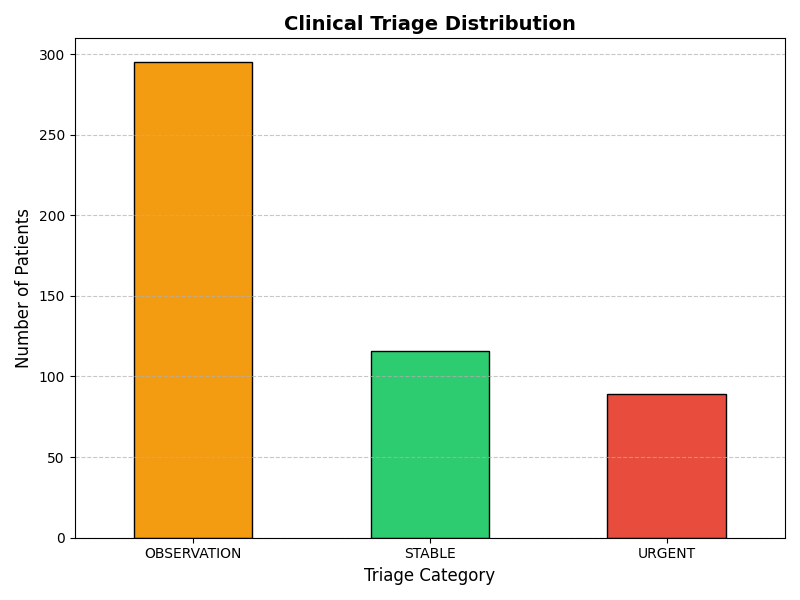

# Automated Clinical Triage & EHR Batch Processing System using Python 🏥💻

## 📌 Project Overview
A robust, automated clinical data processing pipeline built with Python. Designed for healthcare facilities and medical researchers, this tool simulates the mass processing of Electronic Health Records (EHR). It ingests patient vital signs in bulk, applies strict medical logic to calculate BMI, evaluates clinical parameters, and categorizes patients into triage levels (URGENT, OBSERVATION, STABLE) in seconds.

## 🚀 Key Features
* **Synthetic Medical Data Generation:** Utilizes `NumPy` to generate statistically realistic patient data (N=500), reflecting normal physiological distributions for vitals like SpO2, Heart Rate, Respiratory Rate, and Blood Pressure.
* **Automated Batch Processing:** Leverages `Pandas` to read, clean, and process large datasets (.csv) efficiently without manual data entry.
* **Clinical Triage Algorithm:** Implements customized medical thresholds to automatically flag critical patients requiring immediate intervention.
* **Data Visualization:** Employs `Matplotlib` to instantly generate clinical distribution dashboards, aiding hospital administrators in resource allocation and decision-making.

## 🛠️ Technical Stack
* **Language:** Python
* **Libraries:** Pandas (Data Manipulation), NumPy (Statistical Data Generation), Matplotlib (Visualization)
* **Domain Knowledge:** Clinical Medicine (MBBS), Public Health, Medical Triage Protocols

## 📊 Triage Distribution Dashboard
*(Showing the automated categorization of 500 simulated patients)*

---
*Developed by Ahmed Elhassan - Medical Doctor (MBBS) & Healthcare Data Analyst.*
